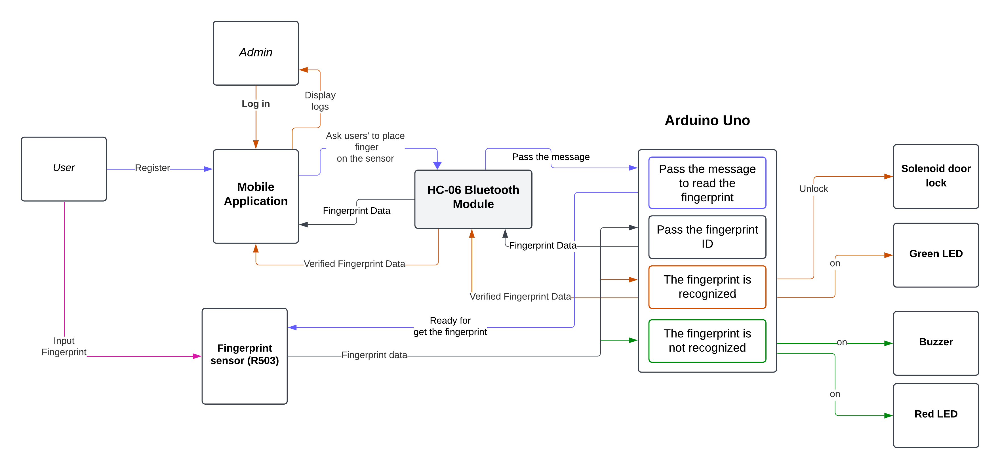
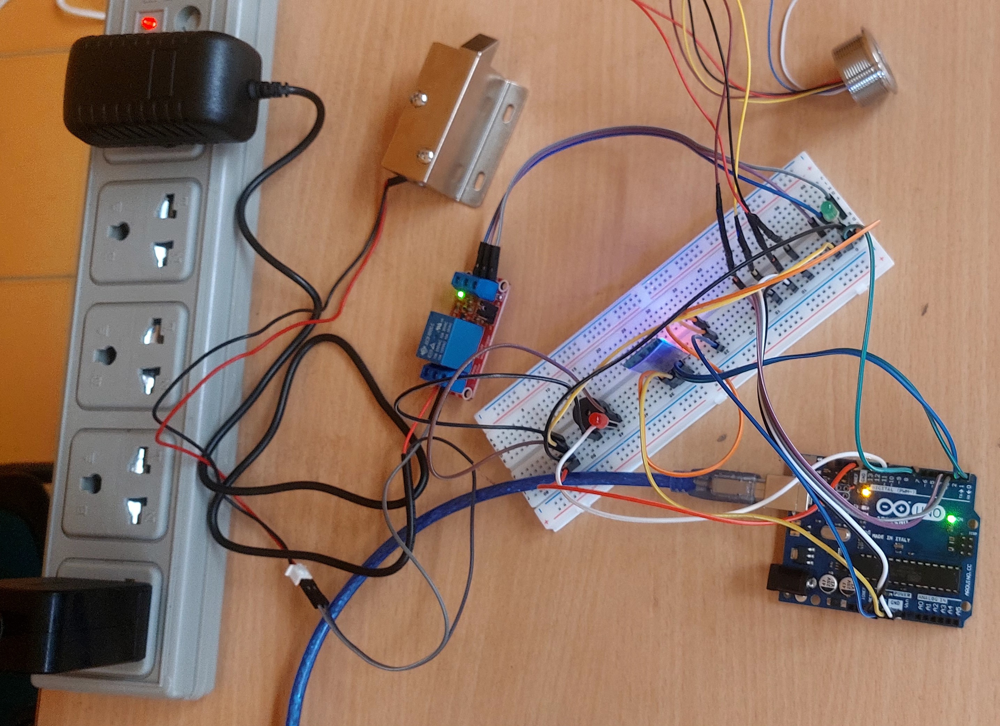

# B20_Group16 - Smart Door Lock System with Fingerprint Authentication

## Project Overview  
The **Smart Fingerprint-Based Door Lock System** is a secure and efficient access control system that integrates **biometric authentication with IoT technology**. This project enhances security by allowing only registered users to access a door, locker, or restricted area using **fingerprint authentication**.  

The system consists of an **Arduino Uno**, a **Fingerprint Sensor (R503)**, a **Solenoid Lock**, an **HC-06 Bluetooth Module**, LEDs, and a Buzzer. It is designed to be user-friendly, with a **mobile application** enabling user registration and admin access.  

## Functionality  
- **App Functionality:**  
  - **Users register** their details and add their fingerprint via the fingerprint sensor.  
  - The **admin** can log in to **view access logs**.  

- **Access Control:**  
  - When a **registered user** scans their fingerprint:  
    - The **solenoid lock unlocks**.  
    - A **green LED lights up**, indicating successful authentication.  
  - When an **unregistered user** attempts access:  
    - The **buzzer activates** as an alert.  
    - A **red LED lights up**, indicating unauthorized access.  

## Components Used  
### Hardware  
- **Arduino Uno** – Microcontroller to control the system.  
- **R503 Fingerprint Sensor** – Captures and verifies fingerprints.  
- **Solenoid Lock** – Locks and unlocks the door based on authentication.  
- **HC-06 Bluetooth Module** – Facilitates communication between the Arduino and the mobile app.  
- **LEDs (Green & Red)** – Indicate access status.  
- **Buzzer** – Alerts for unauthorized access attempts.
- **Relay** – Acts as a switch and enables 12V to the solenoid lock when needed.
- **Power Supply** – Provides a 12V DC current to the Solenoid lock.  

## **Software Requirements**  
- **Android Studio** (for mobile app development)  
- **Visual Studio Code** (for backend development)  
- **Java** (Used for the mobile app)
- **Node JS** (Used for backend)  
- **MongoDB** (Used for the database)  

## Applications  
This system can be used in various real-world applications, such as:  
✔ **Smart home security systems**  
✔ **Office or restricted area access control**  
✔ **Secure lockers and cabinets**  

## Circuit Diagram  

## Block Diagram  
 

## Implementation  

## Contributors  
This project was developed by **Group 16** from **Batch 20**:  

| Student ID | Name |  
|------------|-------------------------|  
| 204104H | Kularathna M.D.S.A. |  
| 204137K | Nethmini S.A.R. |  
| 204041K | Dilshan K.G.A.P. |  
| 204064H | Gunasiri G.C.S. |  
| 204244K | Jayasinghe N.D. |  
